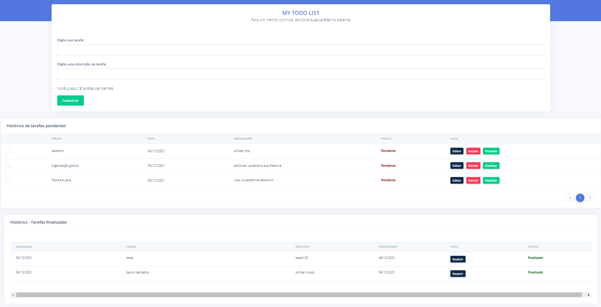

### Frontend

- Faça o setup de um novo projeto - &#10003;
- Criar uma página com formulário para inclusão da lista de TODOs. A página deverá conter:
  - Campo de input para inserir a descrição - &#10003;
  - Botão para cadastrar - &#10003;
- Na mesma página, crie uma tabela para visualizar os itens já cadastrados. A tabela deverá possuir as seguintes ações para cada item:
  - Botão para editar o texto - &#10003;
  - Botão para excluir o item - &#10003;
  - Botão para finalizar o item - &#10003;
- Os itens finalizados deverão ser apresentados em uma cor diferente dos demais itens na lista - &#10003;
- Criar uma opção para selecionar todos os itens da lista e um botão para finalizar todos com uma única ação - &#10003;

Tela final do frontend:

### Backend

- Faça o setup de um novo projeto
- Criar APIs Rest para as seguintes operações:
  - Listar os itens salvos - &#10003;
  - Salvar / Atualizar um item - &#10003;
    - Poderá ser utilizado também para mudar o status do item para finalizado
  - Excluir um item - &#10003;
  
